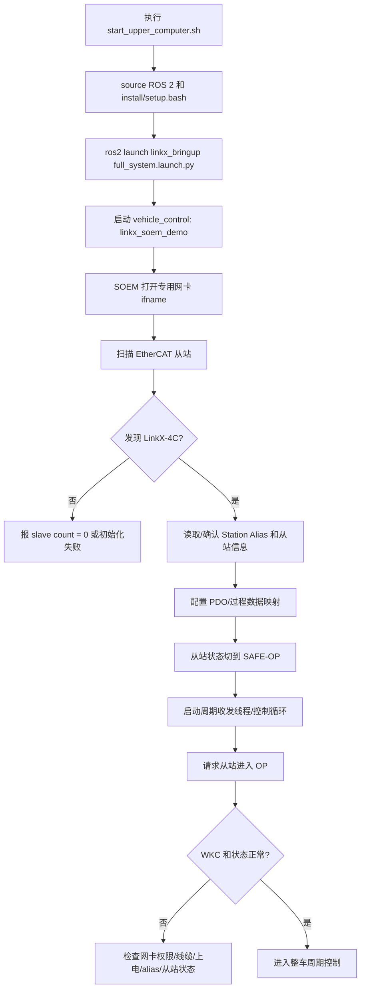

# Ethercat-R2 上位机控制栈

基于 **SOEM / EtherCAT 主站 + LinkX-4C CAN 桥** 的 R2 整车 ROS 2 控制工作空间。
PC 通过一张普通以太网卡跑 EtherCAT,经由 LinkX-4C 把 4 路经典 CAN 桥到舵向(DM6225)/ 轮向(DM3519)/ 升降(Gantry)/ 机械臂(Arm) 等设备。
手柄(Logitech F710)通过 `joy` 解算成 `/cmd_vel` 与按键话题,再由 relay 转发给整车主控。

- 平台:Ubuntu + ROS 2 Humble
- 主语言:C / C++17
- 默认控制入口:`./start_upper_computer.sh`
- 默认 EtherCAT 网卡:`enxf01e341224fd`

---

## 系统链路

```
Logitech F710
    │
    ▼
joy_node ──► remote_node_cpp ──► /cmd_vel, /robot_buttons
                                      │
                                      ▼
                              stm32_node_cpp(chassis_relay)
                                      │
                                      ▼
                            /chassis/cmd_vel, /chassis/buttons
                                      │
                                      ▼
linkx_soem_demo(vehicle_control) ──► EtherCAT ──► LinkX-4C ──► CAN1~CAN4 ──► 电机/升降/机械臂
```

核心思路:

- ROS 2 层只负责手柄、上层速度指令、话题转发与参数管理。
- `linkx_soem_demo` 是实时性要求最高的整车主控入口,负责 EtherCAT 初始化、LinkX-4C CAN 桥接和各机构调度。
- 上层规划/导航可以直接发布 `/cmd_vel`,也可以绕过手柄链路直接发布 `/chassis/cmd_vel`。

## EtherCAT 相关知识

EtherCAT 是一种运行在标准以太网物理层上的实时工业总线。本项目中 PC 作为 EtherCAT 主站,LinkX-4C 作为 EtherCAT 从站,主站通过一张专用网卡直接收发原始以太网帧,再由 LinkX-4C 把 EtherCAT 过程数据转换到 4 路经典 CAN。

几个关键概念:

| 概念 | 说明 | 本项目中的对应关系 |
| --- | --- | --- |
| 主站(Master) | 发起总线扫描、配置和周期通信的一方 | PC 上的 `linkx_soem_demo`,底层使用 SOEM |
| 从站(Slave) | 被主站扫描和配置的 EtherCAT 设备 | LinkX-4C |
| PDO | 周期过程数据,用于高频控制和状态反馈 | 主控周期发送/接收 LinkX-4C 的 CAN 桥接数据 |
| SDO | 非周期配置数据,用于参数读写 | 写 Station Alias、设备配置和诊断时使用 |
| Station Alias | 从站别名地址,用于稳定识别设备 | R2 建议 LinkX alias 为 `2` |
| EtherCAT 状态机 | 从站从 `INIT` 到 `PRE-OP`、`SAFE-OP`、`OP` 的启动过程 | 主控初始化时必须进入 `OP` 才能稳定周期通信 |
| WKC | Working Counter,用于判断一帧过程数据是否被预期从站处理 | WKC 异常通常表示从站掉线、网线问题或状态不对 |
| DC | Distributed Clocks,分布式时钟同步机制 | 多从站高同步需求时使用,当前项目主要关注稳定周期通信 |

EtherCAT 和普通网络通信的区别:

- 它不是 TCP/UDP 通信,不会通过 IP 地址连接设备。
- SOEM 需要直接打开网卡收发 raw Ethernet frame,所以需要 `sudo` 或 `setcap cap_net_raw,cap_net_admin+ep`。
- EtherCAT 网卡建议专用,不要同时承担上网、SSH、远程桌面等普通网络流量。
- 从站顺序、alias、上电状态和线缆质量会直接影响扫描结果和工作状态。

### EtherCAT 启动过程路径图



### 控制数据过程路径图

```mermaid
flowchart LR
    A[F710 手柄] --> B[joy_node]
    B --> C[remote_node_cpp]
    C --> D[/cmd_vel 和 /robot_buttons]
    D --> E[stm32_node_cpp: chassis_relay]
    E --> F[/chassis/cmd_vel 和 /chassis/buttons]
    F --> G[vehicle_control 订阅 ROS 指令]
    G --> H[robot/task 顶层调度]
    H --> I[chassis/gantry/arm/navigation]
    I --> J[Motor/OPS/LinkX 设备层]
    J --> K[SOEM EtherCAT 周期帧]
    K --> L[LinkX-4C]
    L --> M[CAN1~CAN4]
    M --> N[DM 电机/升降/机械臂等设备]
    N --> M
    M --> L
    L --> K
    K --> G
```

对应源码路径:

| 阶段 | 主要路径 |
| --- | --- |
| launch 启动 | `src/linkx_bringup/launch/full_system.launch.py` |
| 一键脚本 | `start_upper_computer.sh` |
| 主控入口 | `src/linkx_soem_demo/src/vehicle_control/main.cpp` |
| SOEM 底层 | `src/linkx_soem_demo/src/vehicle_control/1_Middleware/soem/` |
| LinkX 协议 | `src/linkx_soem_demo/src/vehicle_control/1_Middleware/linkx/` |
| EtherCAT 管理 | `src/linkx_soem_demo/src/vehicle_control/2_Device/Ethercat/ecat_manager/` |
| LinkX-4C 处理 | `src/linkx_soem_demo/src/vehicle_control/2_Device/Ethercat/linkx4c_handler/` |
| 机构控制 | `src/linkx_soem_demo/src/vehicle_control/3_Chariot/` |
| ROS 交互封装 | `src/linkx_soem_demo/src/vehicle_control/4_Interaction/robot/` |
| 顶层任务 | `src/linkx_soem_demo/src/vehicle_control/5_Task/task/` |

### EtherCAT / FDCAN 桥接可靠性

桥接层启动时会先完成 EtherCAT 扫描、PDO 映射和 SAFE-OP 检查,再唤醒 LinkX-4C 的 4 路 CAN PHY 并配置波特率。任一关键步骤失败都会中止整车主控初始化,避免在从站状态异常或 CAN 通道未就绪时继续进入 OP。

周期通信中 `ecat_master_sync()` 会返回 SOEM 的 WKC(Working Counter),并和初始化阶段计算出的 `expected_wkc` 比较。WKC 连续异常时会打印从站状态和 AL status code,优先检查专用网卡、LinkX 上电、网线、从站状态和 PDO 映射。

LinkX CAN 接口保留 8 字节快捷发送函数,同时提供可变长度接口:

| 接口 | 用途 |
| --- | --- |
| `linkx_quick_can_send()` | 经典 CAN 8 字节快捷发送,兼容现有 DM 电机控制 |
| `linkx_quick_FDcan_send()` | CAN-FD 8 字节快捷发送 |
| `linkx_send_classic_can_frame()` | 经典 CAN 可变长度发送,超过 8 字节会按经典 CAN 上限截断 |
| `linkx_send_fdcan_frame()` | CAN-FD 可变长度发送,支持最多 64 字节 payload |
| `linkx_quick_recv()` | 接收 CAN / CAN-FD 帧,输出 `canfd/brs/ext/rtr/dlen/timestamp` 和最多 64 字节数据 |

## 目录结构

```
Ethercat-R2/
├── README.md
├── start_upper_computer.sh             # 一键启动脚本(joy + remote + relay + 主控)
└── src/
    ├── linkx_bringup/                  # launch / 参数包
    │   ├── launch/
    │   │   ├── full_system.launch.py   # 完整系统(默认入口)
    │   │   └── teleop.launch.py        # 仅遥控数据通路(无主控)
    │   └── config/
    │       ├── teleop.params.yaml
    │       └── fastrtps_profiles.xml
    └── linkx_soem_demo/                # 主控 + 工具集 + ROS 桥
        ├── src/
        │   ├── vehicle_control/        # 整车主控可执行
        │   │   ├── main.cpp
        │   │   ├── 1_Middleware/       # SOEM / LinkX / Algorithm(PID, ramp)
        │   │   ├── 2_Device/           # Ethercat / Motor / OPS / rt_timing
        │   │   ├── 3_Chariot/          # chassis / gantry / arm / navigation
        │   │   ├── 4_Interaction/      # robot
        │   │   └── 5_Task/             # task 顶层调度
        │   ├── remote/                 # 手柄解算 + 串口/话题转发
        │   │   ├── ros2/               # remote_node / stm32_node / joystick_mapper
        │   │   └── device/Remote/      # F710 手柄驱动
        │   └── test_mains/             # 独立工具(标定 / 调参 / 链路测试)
        ├── include/
        └── CMakeLists.txt
```

主控源码遵循 `1_Middleware → 2_Device → 3_Chariot → 4_Interaction → 5_Task` 五层分层(命名沿用 R1 框架)。

### 主控分层说明

| 层级 | 责任 | 典型内容 |
| --- | --- | --- |
| `1_Middleware` | 第三方/底层通信与通用算法 | SOEM、LinkX 协议、PID、ramp、数学工具 |
| `2_Device` | 单设备驱动与 EtherCAT 管理 | `Ethercat/ecat_manager`、`linkx4c_handler`、DM 电机、OPS、实时计时 |
| `3_Chariot` | 机构级控制 | 全向/舵轮底盘、升降、机械臂、导航接口 |
| `4_Interaction` | 机器人交互封装 | `robot` 对 ROS 话题和机构状态的整合 |
| `5_Task` | 顶层任务调度 | 初始化顺序、周期任务、状态流转 |

---

## 依赖

- **ROS 2 Humble** (`/opt/ros/humble/setup.bash`)
- `ros-humble-joy`(手柄驱动)
- `libpcap-dev`(SOEM 原始以太网)
- 编译器:GCC ≥ 9 (C++17)
- 硬件:Logitech F710 / 兼容手柄,LinkX-4C CAN 桥设备,一张专用 EtherCAT 网卡

Ubuntu/ROS 依赖安装示例:

```bash
sudo apt update
sudo apt install -y ros-humble-joy libpcap-dev
```

建议把 EtherCAT 网卡独立出来,不要同时用于上网、远程桌面或普通局域网通信。

---

## 构建

```bash
source /opt/ros/humble/setup.bash
colcon build --cmake-args -DCMAKE_BUILD_TYPE=Release
source install/setup.bash
```

> 首次运行 `start_upper_computer.sh` 时会自动 `colcon build`。

构建产物主要在:

- `build/linkx_soem_demo/`:开发期直接运行的可执行文件
- `install/linkx_soem_demo/lib/linkx_soem_demo/`:ROS 2 install 后的可执行文件
- `log/`:colcon 构建日志

---

## 网卡权限

SOEM 需要 raw 以太网权限,二选一:

```bash
# 方案 A:每次 sudo(默认脚本走这条)
sudo ./start_upper_computer.sh

# 方案 B:给可执行文件一次性赋能力,之后无需 sudo
sudo setcap cap_net_raw,cap_net_admin+ep \
    install/linkx_soem_demo/lib/linkx_soem_demo/linkx_soem_demo
./start_upper_computer.sh --no-sudo
```

如果使用 `setcap`,每次重新编译后可执行文件可能被覆盖,需要重新执行一次 `setcap`。

运行前建议先确认网卡存在并处于 up 状态:

```bash
ip link show enxf01e341224fd
sudo ip link set enxf01e341224fd up
```

---

## 启动

### 一键脚本

```bash
# 默认:网卡 enxf01e341224fd,sudo 启动,max_speed=1.5
./start_upper_computer.sh

# 指定网卡
./start_upper_computer.sh --ifname eth0

# 仅启动 ROS 话题层,不启动 EtherCAT 主控(适合远程调试 / 单测)
./start_upper_computer.sh --no-vehicle

# 同时启动云台话题转发
./start_upper_computer.sh --gimbal

# 限速
./start_upper_computer.sh --max-speed 1.0
```

### 直接 launch

```bash
ros2 launch linkx_bringup full_system.launch.py \
    ifname:=enxf01e341224fd \
    max_speed:=1.5 \
    start_vehicle_control:=true \
    start_gimbal_bridge:=false
```

常用 launch 参数:

| 参数 | 默认值 | 说明 |
| --- | --- | --- |
| `ifname` | `enxf01e341224fd` | EtherCAT 网卡名 |
| `max_speed` | `1.5` | 手柄映射到 `/cmd_vel` 的最大线速度 |
| `start_vehicle_control` | `true` | 是否启动 EtherCAT 整车主控 |
| `start_gimbal_bridge` | `false` | 是否启动云台话题转发 |
| `vehicle_prefix` | 空 | 给整车主控加启动前缀,常用于 `sudo -E env LD_LIBRARY_PATH=$LD_LIBRARY_PATH` |
| `ros_nodes_prefix` | 空 | 给 ROS 节点加启动前缀,调试时可接 `gdb`/`valgrind` |

启动后的节点拓扑:

```
joy_node ──► /joy ──► remote_node ──► /cmd_vel ─────┐
                                  └─► /robot_buttons┤
                                                     ▼
                                          chassis_relay ──► /chassis/cmd_vel
                                                        └─► /chassis/buttons
                                                                │
                                                                ▼
                                                  vehicle_control(EtherCAT 主控)
```

---

## 可执行清单

`linkx_soem_demo` 包构建以下可执行(`install/linkx_soem_demo/lib/linkx_soem_demo/` 下):

| 可执行 | 用途 |
| --- | --- |
| `linkx_soem_demo` | **整车主控**:SOEM 主站 + LinkX-4C CAN 桥 + chassis/gantry/arm/navigation 调度 |
| `remote_node_cpp` | 手柄解算:`/joy` → `/cmd_vel` + `/robot_buttons` |
| `stm32_node_cpp` | 通用话题转发(参数化输入/输出话题,可复用做 chassis_relay / gimbal_relay) |
| `linkx_set_alias` | LinkX EEPROM Station Alias 写入工具(脱离物理串接顺序) |
| `can_link_test` | 4 通道经典 CAN 1Mbps 链路冒烟测试 |
| `motor_calib` | DM6225 / DM3519 电机参数标定(动/静摩擦、惯量) |
| `steer_tuning` | 舵向 PID 网格自动扫参,输出 `var_data/steer_tuning_results.csv` |
| `robot_test` | 整车回归(Init / EtherCAT / TIM / ROS 桥 / 限速短转 / Gantry / Arm) |

---

## 运行前检查

1. 确认 EtherCAT 网卡名正确:

   ```bash
   ip -br link
   ```

2. 确认手柄被系统识别:

   ```bash
   ls /dev/input/js*
   ros2 run joy joy_node
   ros2 topic echo /joy
   ```

3. 确认 LinkX-4C 已上电、网线连接到专用 EtherCAT 网卡。

4. 确认危险机构处于安全状态,尤其是轮向标定时必须架空目标轮。

5. 首次联调建议先使用 `--no-vehicle` 检查 ROS 话题链路:

   ```bash
   ./start_upper_computer.sh --no-vehicle
   ros2 topic echo /cmd_vel
   ros2 topic echo /chassis/cmd_vel
   ```

---

## 常用工具用法

### 写入 LinkX Station Alias(R2 建议 `alias=2`)
```bash
sudo ./linkx_set_alias enxf01e341224fd show
sudo ./linkx_set_alias enxf01e341224fd set <slave_idx> <alias>
# ⚠ 写完必须给 LinkX 断电再上电,aliasadr 才生效
```

### CAN 链路冒烟
```bash
sudo ./can_link_test enxf01e341224fd
```

### DM 电机标定
```bash
# 舵向 DM6225:不需要架空,但解除负载/机械臂归位
sudo IFNAME=enxf01e341224fd ./motor_calib --motor steer --wheel 0 --test all

# 轮向 DM3519:必须把目标轮架空
sudo IFNAME=enxf01e341224fd ./motor_calib --motor wheel --wheel 0 --test all
```

### 舵向 PID 扫参
```bash
sudo ./steer_tuning enxf01e341224fd
# 进入交互后按 'a' 进入 AUTO_SWEEP,或 export TUNE_AUTO=1
```

扫参结果默认写入 `var_data/steer_tuning_results.csv`,可用于对比不同 PID 组合的误差、超调和稳定时间。

### 整车回归
```bash
sudo ./robot_test enxf01e341224fd
```

建议工具执行顺序:

1. `linkx_set_alias show`:确认 LinkX 站号和 alias。
2. `can_link_test`:确认 4 路 CAN 链路可达。
3. `motor_calib`:完成单电机基础标定。
4. `steer_tuning`:完成舵向闭环参数调整。
5. `robot_test`:做整车主控回归。

---

## 话题约定

| 话题 | 类型 | 方向 |
| --- | --- | --- |
| `/joy` | `sensor_msgs/Joy` | `joy_node` 发布 |
| `/cmd_vel` | `geometry_msgs/Twist` | `remote_node` 发布,任意上层节点也可发布 |
| `/robot_buttons` | `std_msgs/...` | `remote_node` 发布 |
| `/chassis/cmd_vel` | `geometry_msgs/Twist` | `chassis_relay` 转发,主控订阅 |
| `/chassis/buttons` | 同上 | 同上 |
| `/gimbal/cmd_vel`、`/gimbal/buttons` | 同上 | 可选(`--gimbal`) |

> 任何外部规划/导航节点可以直接发布 `/cmd_vel`(与手柄共用入口),或绕过手柄直接发布 `/chassis/cmd_vel`。

速度指令约定:

- `/cmd_vel.linear.x`:底盘前后速度。
- `/cmd_vel.linear.y`:全向底盘横移速度。
- `/cmd_vel.angular.z`:底盘旋转角速度。
- `remote_node_cpp` 会按 `max_speed` 限制手柄输入幅度。

---

## 配置入口

- 默认网卡:`start_upper_computer.sh` 中 `IFNAME=enxf01e341224fd`,或 `--ifname` / 环境变量 `IFNAME` 覆盖
- 手柄死区 / 自动重复率:`full_system.launch.py` 中 `joy_node` 参数
- 最大线速度:`remote_node` 的 `max_speed` 参数,或 `--max-speed`
- FastRTPS profile:`src/linkx_bringup/config/fastrtps_profiles.xml`
- relay 输入/输出话题:`full_system.launch.py` 中 `stm32_node_cpp` 的参数

---

## 排错速查

| 现象 | 排查方向 |
| --- | --- |
| 启动报 `Failed to open interface` | 网卡名错 / 被其他进程占用 / 没有 raw 权限(`sudo` 或 `setcap`) |
| `slave count = 0` | LinkX 没上电、网线串接顺序异常、或 alias 未写入 |
| 手柄不动 | `ros2 topic echo /joy` 看 `joy_node` 是否在发,确认 F710 拨到 `D` 档 |
| 主控启动但底盘无响应 | `ros2 topic echo /chassis/cmd_vel`,检查 `chassis_relay` 是否在转发 |
| DM 电机抖动 / 过冲 | 用 `steer_tuning` 重新扫参,先 `motor_calib` 标定摩擦/惯量 |
| `setcap` 后仍提示权限不足 | 确认可执行文件是最新构建产物,重新执行 `setcap` |
| `colcon build` 找不到 ROS 包 | 先 `source /opt/ros/humble/setup.bash`,并确认当前目录是工作空间根目录 |

---

## 安全注意事项

- 调试电机、底盘、升降或机械臂前,确保急停、支撑和限位有效。
- 轮向电机标定必须架空目标轮,避免车辆突然运动。
- 修改 PID、摩擦补偿、速度上限后,先低速空载验证,再上车联调。
- EtherCAT 主控建议使用专用网卡,避免系统网络服务打断实时通信。
